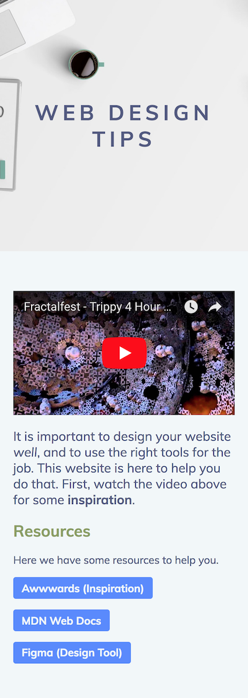

# 1. Thinking of the Web

This workshop will leave you with the ability to create your own website. Not only will we teach you how to code, but we'll be covering some of the tools and thought processes you may use to design and create content for your website.

Before we write a line of code, let's think a little bit about what you'd want your website to achieve.

## 1.1 The Purpose of the Web

The initial purpose of the "world wide web" was to distribute information. A _web_ of interconnected documents that made all human knowledgeable accessible simply by clicking.

Since its inception, the web has expanded to do a lot more than that. Nowadays we can write documents, order food, play games and more on the web but its primary purpose is still as strong as ever.

In this workshop we'll cover the purpose of distributing information, by trying to make a website that does exactly that. It will, however, give you a springboard to explore all those other things the web can do nowadays.

It will help to be aware and critical when visiting websites. Does a website let you do what you want to quickly? Does it make you angry? Does it look good? Why do you think it does this? This will help you to steal good ideas and avoid the mistakes of others.

## 1.2 Design Before Building

The most useful thing that you can do before setting out to create your website is deciding what it will be about. Is there a cause you're passionate about, a project you did, or a blog you want to start? If you're struggling for ideas, a personal website is a good place to start. This is like an online CV or a LinkedIn page with a little more personality.

Once you know what you're trying to convey, it can help to think a little bit about what you want it to look like. This will help to keep you focused when creating it, and also give you some real goals to reach when learning how.

You don't need sophisticated tools to do this, pen and paper will do just fine. Sketch out a simple idea and focus on the big details, such as what sections you want, if you want multiple pages and what images could work.

Over the course of this workshop, I will be building a website about web design and showing you how I do it. Here's a design a sketched out design of this.


I'll explain the bits and pieces as we make them, but it's a good place to start. I've taken cues from websites I like, such as this concept of a "hero", which is a section at the start of a website with large text and a colourful background of some sort. Below, you'll see MDN (a website we will return to) has the same.


- Looking for inspiration? Check out [Awwwards](https://www.awwwards.com/) for some examples of websites that push the boundary of design.
- There are lots of tools that let you design in much finer detail. [Figma](https://www.figma.com/) is one such tool, and is free!

---

**Task**: Decide on a topic for a website you want to create.  
**Task**: Sketch out a rough design of the website, on whatever tool you think suitable.

---

Now that we've thought a little bit about our goals, we can actually start building something. Let's move onto the first language of the web: *HTML*.

# 2. HTML: Displaying Information

## 2.1 Setting Up

A website is split up into different components that describe the information that is given to you, what that information looks like, and how it can be interactive and dynamic. We do this through *three different languages*: HTML, CSS and JavaScript respectively. Today we will be focusing on displaying that information through *HTML*.

Previously we asked you to set up a text editor (check out the setup instructions for details on this). A text editor does exactly what its name describes: gives you the ability to edit text.

Firstly, we want a place for our website to live on our computer. A website is made up of multiple files, so it makes sense for it to have its own folder. Make this folder anywhere on your computer, and give it a name. I'm going to call mine `web-design-website`. After making the folder, I can open it in the text editor. In Visual Studio Code, this is done through `File>Open`.

In this folder, you want to create a new file. Call it `index.html`. We give it the name `index` by convention, and give it the extension `.html` because it is an HTML file.


To preview this, open your `index.html` file in any _modern_ web browser (such as Google Chrome). Usually double clicking on the `index.html` file does this (`File>Open` works as well). You should see... nothing!


This is just your browser showing you an empty website. We'll soon fill it with content.

---

**Task**: Get a text editor/JSBin ready.  
**Task**: Open a new folder.  
**Task**: Make an empty `index.html` file.  
**Task**: Open it in your web browser.

---

## 2.2 Writing your first HTML

### An Aside About Syntax

We said that we were going to learn how to present information. At first, it ain't gonna be pretty.

HTML is the language that is used to do this, it stands for _HyperText Markup Language_. This basically means that it takes ordinary text and gives it meaning by tagging certain parts of it. For every single website you visit, the first thing it does is load an HTML file. Here is an example:

```html
<element attribute="value">
    <nestedelement>
        Text
    </nestedelement>
    <selfclosingelement />
</element>
```

You can put the syntax down to a few core aspects:

- There are tags that you write out using the `<` and `>` signs, which open up an element.*   Everything you put in-between that tag and the closing tag is inside that element, and you can even put more elements within it.
- To close an element, just end it with the closing tag by putting a forward slash before its name within the tag.
- Some elements are _self closing_, and you can't put anything inside them. They have a forward slash before the `>` sign in the tag.
- Finally, there are attributes that you can set within elements. These are set using the `attribute="value"` notation within the tag, after its name. These will come to mean more later on

What was written above actually isn't valid HTML, there is a limited set of elements that exist and they represent different parts of a website - for example there is an element for images and there is one for headings.

### Adding Content to the Screen

Now that we are empowered by what HTML looks like, let's edit our `index.html` file that we made earlier, adding the following HTML code:

```html
<!DOCTYPE html>
<html>
    <body>
        <h1>Web Design Tips</h1>
    </body>
</html>
```

Once you've added this content, **save it**, then, **refresh your browser**. This is crucial for you to see your changes. Everything going well, you should see...


What's going on with this code you just put in? Stepping through it line by line:

1. This is a "doctype". It betrays the syntax we just introduced, but it lets the browser know that you are writing HTML
2. This is the first tag of the document, the `html` tag. All of our HTML goes in here
3. The `body` tag opens, inside this tag is everything that the user can _see_
4. This is a complete `h1` tag, with some text inside it. `h1` means the top level heading of a document - there are `h2, h3, h4, h5, h6` as well.
5. Closing of the body tag (never forget to close!)
6. Closing of the HTML tag

**Note**: If you want to find out about a tag, or try to do something you don't know how to do, a good place to start is by searching. Google will likely find you the answers you're looking for. [MDN Web Docs](https://developer.mozilla.org/) is also a fantastic resource for all things web.

---

**Task**: Add this content to your `index.html` file.  
**Task**: Give your website a heading that is more fitting for your content.

---

## 2.3 Some Basic Tags

### Paragraphs

The `<p>` tag is where you put main text. Where you'd usually put two line breaks in your word processor of choice, you're separating paragraphs - this is how you separate paragraphs in HTML

```html
<p>Lorem ipsum dolor sit amet, sonet audiam theophrastus ex vim, mea ei enim liberavisse interpretaris. Ei minimum deserunt vim, quodsi philosophia ea vix. An laudem integre sapientem mei. Legere adipisci mea et, duo dicunt invenire et, mel ad veniam iriure aperiam.</p>

<p>Vel ei ferri praesent. Per id exerci civibus, no commodo numquam ocurreret vim. Ex vim possim everti, mel insolens laboramus ex, mei verear integre eu. Eu epicurei delicatissimi pri, alterum feugiat pertinax ut qui. Ex nec omnes accommodare, eum ut regione incorrupte. An docendi reformidans vix.</p>
```

---

**Task**: Write a few paragraphs on something. For example: introducing yourself and why your website is worth reading. Add some extra `h1-6` tags to give it some structure.

---

### Adding Flair

Where would we be if we couldn't _emphasise_ or **scream** out text? HTML let's you do this with the `<em>` (emphasis: italics) and `<strong>` (strong: bold) tags.

```html
This is some text that I am <em>emphasising</em>. I am also making it <strong>strong</strong>.
```

---

**Task**: Let your reader know what is important by emphasising and strengthening some of your content.  
**Challenge**: There are many more tags you can use. Can you find out what `<small>`, `<ul>`, `<ol>` and `<table>` are for, and put them to use?

---

## 2.4 Links

HTML and the web was so exciting when it was first made because you could link to other pages - suddenly everything was interconnected. This is done through the humble `<a>` tag (for anchor). It specifies where to link to with the `href` attribute.

```html
This is a link to <a href="https://google.com">Google</a>.
```

**A word of warning about URLS in html.** When you supply a URL to a web browser (e.g. `https://google.com`), it is resolved in different ways. What this means is that it won't be interpreted exactly as you write it.

Say that you have a page on `http://mywebsite.com/my/page.html` and there are links to it. There are three different modes:

- The URL is full and absolute, eg: `https://google.com`. This will visit https://google.com as intended
- The URL has a slash at the beginning of it, eg: `/other/page.html` will go to `mywebsite.com/other/page.html`
- The URL has no slash at the beginning and is fully relative, eg: `page2.html` will go to `mywebsite.com/my/page2.html`

This means that you cannot just type `google.com` to link to `https://google.com`. You _have_ to type out the full URL.

---

**Task**: Add some links to your favourite websites.  
**Challenge**: Want your website to have more pages? Try adding another page, (e.g. `mypage.html`), in the same folder as `index.html` and linking to it.

---

## 2.5 Images

### Finding Images

Images help to convey the information you want to. They're easy enough to put in your website. The hardest part is usually finding or creating the right images to use. Unfortunately, you can't legally take most images you see on the web and put it into your website (although you can technically).

However, there are websites that let you access images you can access legally. [Pexels](https://pexels.com) is one such website. You can search for images, download them and include them in your website with a clear conscience. For example, after searching for "laptop", I found [this image](). To get it ready for my website, I want to

- Download the image at an appropriate size (images that are too big slow your website down). 1200x768 looks like a good size.
- Put the file in my website folder.
- Give it a sensible name (such as `desk.jpeg`). 


---

**Task**: Find at least one image to put on your website.

---

### Using Images

**Note**: All of the rules about URLs specified earlier apply here.

You use the `` tag to tell the browser to display an image, and the `src` attribute to specify where that image is on the web. Optionally, you can use the `alt` attribute to _describe_ the image. This is useful for visually impaired users and search engines who both have a hard time of telling what is in the image.

```html

```


It's still quite oversized! We'll go over how to make these images behave properly in terms of sizing, later.

---

**Task**: Add your image(s) to your website.

---

## 2.6 Embedding Other Media

You may want to embed other kinds of media, such as video. There _is_ a `<video>` tag but sourcing and hosting video is rather difficult. Fortunately, popular hosting websites like [YouTube](https://youtube.com).

Embedding media from these websites is surprisingly easy, they usually have an embed button tucked away _somewhere_, which gives you a snippet of HTML code. For example, on YouTube it's inside the "share" box.


It gives me an HTML snippet, which I can put in my website.

```html
<iframe width="560" height="315" src="https://www.youtube.com/embed/Fi2PPHEqXsw" frameborder="0" allow="autoplay; encrypted-media" allowfullscreen></iframe>
```


Lots of websites allow for this, such as Twitter and Facebook.

---

**Task**: Embed a video into your website.  
**Challenge**: Try embedding another kind of media, such as a tweet or Facebook like button.

---

## 2.7 The `<head>` Tag

Earlier, we introduced you to the `body` tag. This is everything the user can _see on the page_. What about other things? You'll notice this ugly "index.html" in your tab bar. Other websites have a useful description of what they are.


We can change this, but not by putting anything on the page. This is done by adding a `head` tag before your body tag, and putting a `title` tag in that to set the _title_ of the page.

```html
<html>
    <head>
        <title>Web Design Tips</title>
    </head>
    <body>
      ...
    </body>
</html>
```


Much better!

---

**Task**: Give your website a title in the `head` tag.

---

This is all we have to say on HTML for now. You can see the finished result [in the example-01-html folder of the examples repo](https://github.com/hackersatcambridge/workshop-web-dev/tree/master/example-01-html).

This website has content, but it doesn't look very good. Next we'll be focusing on how to add styles with CSS to make it visually appealing.

# 3. CSS: Adding Style

At the end of the last section, we left you with a website you could fill with content, but it didn't look particularly nice. CSS is the next language we'll be exploring and it describes what HTML looks like. We call this styling!

## 3.1 Writing Styles with CSS

### Setting Up

CSS code lives in its own file, separate from HTML. Start by making a new file, in the same folder as `index.html`, called `main.css`. `css` because we're making a CSS file, and `main`, again, by convention.

Fill it with this content, so we can tell that the styles are working - we'll go over exactly what this means later.

```css
body {
  background: blue;
}
```

To tell your browser to use this file for your html document, you need to add an HTML tag in your `head` element (the stuff the user can't see).

```html
<link rel="stylesheet" href="main.css" />
```

This is simply saying "use this file I'm giving you as a stylesheet". Notice the `main.css` in the `href` attribute matches the name we gave the file eariler.

Save everything and refresh the page, you should see a beautiful sea of blue.


I know I promised we were going to make the website look better, not _worse_. We'll get there in a moment.

---

**Task**: Add a `main.css` file with the example snippet above.  
**Task**: Add a `link` tag to the `head` element of your `index.html`. Refresh the page and verify that your website is indeed blue.

---

### Syntax

CSS syntax is really simple:

```css
selector {
    property1: value1;
    property2: value2;
}
```

The selector allows us to select an HTML element (or a group of them) and apply different properties to them using the `property: value` syntax. These properties vary far and wide and can do a lot of things such as change the colour, size of the text or where the element is located on the page.

### Selecting Elements: Your First Styles

There are lots of kinds of selectors. One is the element selector, which applies the style to all elements of the given name. Looking back at the snippet you copied verbatim, we can see what this is doing:

```css
body {
    background: blue;
}
```

This applies the style (a blue background) to the `body` element (everything the user can see).

We can apply more styles to the body, such as changing the colour of the text. This is done with the `color` property (_note the American English spelling_).

```css
body {
    background: blue;
    color: white;
}
```


At least we can read the text a bit better. But those links down the bottom, they're still pretty hard to see. We can apply a style to all `a` elements on the page.

```css
a {
    color: yellow;
}
```


---

**Task**: Colour your background, text and links. Try giving your headings a different colour.

---

Finally it's time to abandon these awful colours and actually make this look good.

## 3.2 Making Sense of Colours and Fonts

Some of the easiest steps we can take towards a less visually offensive website is by changing the fonts and colours.

### Colours in CSS

Are we restricted to a small set of colour names like `blue`, `yellow`, `white`, etc. ? Not at all! In fact, all browsers treat these colours slightly differently, so we'd be wise to steer away from them if we want more precise results.

You can describe any colour the screen can render in CSS. There are many different ways to do this, but to actually create the colours on the fly requires an understanding of how computers understand colour which isn't strictly necessary for creating websites. 


In the above image, you'll see various different representations for the same colour. None of them make intuitive sense if you're not familiar with the format.

It's easier to pick the colours visually, and use the code some software gives you. One tool you can use is [Coolors](https://coolors.co). It can randomly generate entire colour schemes for you, which gives you a selection of colours to choose from.


You can also lock colours in, so when generating new schemes, it keeps the colours you want. In my website, I know I want a bright blue, so I generate new schemes until I see a bright blue. Then I lock it, and generate new schemes. I can also tweak colours with the colour picker. After a while, I turned up with this:


Those "hex strings" at the bottom (like `#EF476F`) are the colours you can put in CSS. From this scheme, I've decided to allocate different colours to different parts of my website:

- I want the background to be that off white colour (2nd)
- I want text to be the lighter of the dark colours (4th)
- I want links to be the bright blue (3rd)
- I want headings to be the green (1st)

With a bit of CSS, I can make this happen

```css
body {
  background: #F2F7F9;
  color: #535982;
}

h1, h2, h3, h4, h5, h6 {
  color: #8A9E62;
}

a {
  font-weight: bold;
  color: #5887FF;
}
```

Using commas between selectors (`h1, h2, h3, h4, h5, h6`) allows the selection of multiple elements (all heading elements). `font-weight: bold` makes the links bold so they stand out a bit.


That's looking a lot better.

---

**Task**: With Coolors or otherwise, pick some colours for your website.  
**Task**: Apply some tasteful colours to your website.

---

### Fonts

The fonts on a website are a large part of its personality.

There are countless fonts to choose from, but they need to be on a user's system for them to be visible on a website. Fortunately, CSS allows websites to download fonts on the fly for use.

Where do we find fonts that we can use for free? [Google Fonts](https://fonts.google.com) is a particularly good resource for this. It lets you browse hundreds of fonts, and easily include any number of them on your website.

You can add fonts that you like the look of by clicking on the plus buttons next to them, and then you're given embed instructions. I like the look of "Muli".


Under the "customize" tab, you can choose the _variants_ of the particular fonts you've chosen. Because I use italics and bold on my website, I've added the "bold" and "italic" variants.


Ready to embed, I go back to the "embed" tab and follow the instructions. "Add the code to your `<head>` tag". My head now looks like this:

```html
<head>
    <title>Web Design Tips</title>
    <link href="https://fonts.googleapis.com/css?family=Muli:400,400i,700" rel="stylesheet">
    <link rel="stylesheet" href="main.css" />
</head>
```

And by adding `font-family: 'Muli', sans-serif;` to my body CSS, my website is transformed once more!


---

**Task**: Find a font on [Google Fonts](https://fonts.google.com) that you want to use.  
**Task**: Embed them on your website.  
**Challenge**: You can use different fonts in different places - such as in the headings. Find a different font and use it in different elements on your website.

---

## 3.3 Classes: Fine-grained Selectors

We can now target elements and style them, this is great. But what if we just wanted to target _one_ `<p>` element instead of all of them? For example, I want the introduction paragraph on my website to be slightly bigger. Well, that's where classes come in. We can define a class as an attribute of an element and then select that class in CSS. For example

```html
<p class="introduction-text">Foo bar</p>
```

```css
.introduction-text {
  font-size: 1.2em;
}
```

See the `.` in front of the selector in the CSS code? That's how to select a class.

_em units_: We set the `font-size` of the emphasis paragraph to `1.5em`. `em` units are a relative unit, meaning it depends on the font size of its parent. So by specifying 1.2, we are saying that `.introduction-text` elements should have a font _1.2 times bigger_ than its container.

---

**Task**: Make an important paragraph on your website stand out with classes.  
**Task**: Add some other classes to give your website a little more flavour.

---

## 3.4 Layout

We've changed the size and appearance of individual things on the page. Another important part of styling your website is changing how all of the components fit together. We call this _layout_, as in, how the elements are _laid out_ on the page.

### Inline and Block Elements

You've probably already noticed that some elements flow vertically. `h1` and `p` elements all start on their own lines. These are called _block elements_. They create blocks to fit their content and flow vertically down the page.

Other elements flow with their surrounding text. `em` and `strong` do not start new lines. These elements are called _inline elements_. They fit inline with text and flow horizontally along the page. Except when they reach the end of the line, at this point they flow like words do and wrap to the beginning of the next line. Line breaks can even appear inside inline elements.

A good rule to remember at this point is that it makes sense to put inline elements inside block elements, but you should not put block elements inside inline elements. Later we will explore _inline block_ elements which allow you to do this.

```html
<p><em>This makes sense</em></p>
<em><p>This does not!</p></em>
```

### `div` and `span`

Sometimes you want an element that doesn't really have any meaning, just an extra container to apply styles to. `p` or `h1` don't really make sense in this case.

There are elements that have no intrinsic properties other than that they are either inline or block elements. These are `span` and `div` which are inline and block elements respectively.

```html
<span>I am an inline element</span>
<div>I am a block element</div>
```

Let's put one of these to use. The content on our website is much too wide. The text fits the width of the screen and this can get very hard to read.

To fix this, we can create a new class for our content, called `main-content`.

```css
.main-content {
    width: 600px;
    margin-left: auto;
    margin-right: auto;
}
```

Some new CSS properties there, which we will explain in a moment. However, if we wrap our content in this:

```html
<div class="main-content">
    Your website content
</div>
```

We see something that is much easier to read!


That image is still _massive_. Later on we'll turn it into a hero.

---

**Task**: Add some kind of content container to your website to make text more readable.

---

### The Box Model

In the previous section we started adding CSS properties like `margin` and `width`. These contribute to the size of an element, and are part of the _box model_. This is best described with a diagram, [courtesy of MDN](https://developer.mozilla.org/en-US/docs/Web/CSS/CSS_Box_Model/Introduction_to_the_CSS_box_model).


Basically, the size of an element is made up of these four components:

- **Content**: The size of the content of an element, such as the words or the size of the image.
- **Padding**: The space between the content and the border of the element. You will still see the background of the element in this space.
- **Border**: The an extra space surrounding the element, that can be filled with colour.
- **Margin**: The space between this element and other elements.

These dimensions can be specified in every direction (left, right, top, bottom).

Try experimenting with the properties using this class:

```css
.box-model-test {
  width: 100px;
  height: 100px;
  margin: 10px;
  padding: 10px;
  border: 2px solid black;
  background: red;
}
```


*The pixel unit*: We've been setting these dimensions in terms of `px`, which represents one pixel on the screen. Another way of thinking of these is something very, small. A border of width `1px` would be a hairline border.

*What's the deal with* `margin: auto`? If a block, fixed width element has `margin-left` and `margin-right` set to `auto`, it will centre itself in the middle of the page. Not intuitive, but very useful!

---

**Task**: Experiment with the box model properties.  
**Challenge**: Adding a direction to `margin`, `padding`, or `border` makes it only operate in that direction (such as `padding-left`). Experiment with those properties.  
**Challenge**: Emphasise another area of your website by putting it in a coloured box with some padding.

---

### Making a Button

I want the links at the bottom of my website to stand out a bit more, like the bold buttons I see on other websites. I want to create a new class, `button`, that I can apply to them to make them stand out a bit more.

Here is the class, with comments added.

```css
/* These are comments, they are here only for you to read
   and don't affect the output in any way. */
.button {
    /* Make the element inline block. See below for more explanation. */
    display: inline-block;

    /* Add some padding to keep the text far away from the edges. */
    padding-left: 0.8em;
    padding-right: 0.8em;
    padding-top: 0.4em;
    padding-bottom: 0.4em;

    /* Add some spacing between buttons */
    margin-right: 1em;
    margin-bottom: 1em;

    /* A bright background with light text (replace with your own colour) */
    background: #5887FF;
    color: #F2F7F9;

    /* Make the corners slightly rounded */
    border-radius: 4px;

    /* Links are usually underlined, let's turn that off */
    text-decoration: none;
}
```

We added this particular property, `display: inline-block`. This made each element with the button class an _inline block_ element, which is a combination of inline and block elements. This simply means they flow with text (horizontally, but not across line breaks) and follow the box model like block elements. Inline block elements can contain block elements.

Adding this class to all of the links in the resources section yields a big improvement:


---

**Task**: Emphasise some of the links on your website by turning them into buttons.  
**Challenge**: Can you add some more flair to your buttons? Try adding a border or exploring the use of `box-shadow`.

---

## 3.5 Pseudo Classes and Transitions

When the mouse hovers over the button, and when we click on it, nothing changes on the button to reflect our interaction.

There are selectors in CSS called _pseudo classes, they reflect the particular state that an element is in. For example, if we want to make our buttons _lighter_ when we hover over them and _darker_ when they're pressed (active), we can do that with pseudo classes.

```css
.button:hover {
    background: #91B0FF;
}

.button:active {
    background: #374e89;

    /* Make the button a little smaller */
    transform: scale(0.9);
}
```


But these colour and size changes are quite jolty. Instead of snapping instantly, what if the changes happened over time? There is a CSS property for that, called `transition`. Adding a declaration in your button class (the main one), will make the changes smooth.

```css
.button {
    /* All of your other CSS 
       ...
       ...
     */
    
    /* Changes because of the pseudo classes below should happen over time.
       0.2s means 0.2 seconds. */
    transition: 0.2s;
}
```


Now that is smooth!

---

**Task**: Make your buttons respond to user input by adding pseudo class selectors.  
**Task**: Make them change smoothly using `transition`.  
**Challenge**: It is possible to make different properties change at different speed (e.g. the colour fades over 0.2s but the size over 1s). Can you figure out how to do this?

---

## 3.6 The Hero

Since the inception of my web design tips website, I've wanted a big bold hero section at the top of the website. I'm finally going to make it.

I'm going to create two classes, one for the image background and one for the text. Firstly, the image background

```css
.hero-container {
    /* Add a lot of padding so we can see a lot of the image */
    padding-top: 150px;
    padding-bottom: 150px;
    padding-left: 20px;
    padding-right: 20px;

    /* Set the background to an image */
    background: url(desk.jpeg);

    /* Make the image cover the entirety of the hero */
    background-size: cover;
    background-position: center;

    /* Put the text in the middle */
    text-align: center;
}
```

Then I'm going to remove my `h1` and `img` at the top of my main container, and put this _outside_ of it, at the **root of the body tag**.

```html
<body>
    <div class="hero-container">
        <h1>Web Design Tips</h1>
    </div>
    <div class="main-content">
        The rest of the website
    </div>
</body>
```


That's a start! One thing I notice immediately is that ugly white border around the hero. This is default padding that most browsers add to websites. We can remove it fairly easily:

```css
html, body {
    margin: 0;
    padding: 0;
}
```


Much better!

Finally, let's do something about the text. I want it to be darker, and be in all caps with a lot of spacing between the letters. CSS lets me do all of those things. I make a new class for the heading.

```css
.hero-heading {
    color: #535982;
    text-transform: uppercase;
    letter-spacing: 0.2em;

    /* Removing any default margins */
    margin: 0;
}
```

Then I apply it to the `h1` element inside the hero.


And the hero is done!

## 3.7 Behaving Better on Mobile

A significant portion of users are viewing on a mobile device with a smaller screen. If we look at this website on such a device, we get something less than desireable.


This could be made a lot better. A website that works well on mobile and desktop devices (so a device of any size) is known as a _responsive_ website. Let's make our website responsive.

Firstly, we need to add this tag into the `head` element. 

```html
<meta name="viewport" content="width=device-width, initial-scale=1" />
```

This basically tells the browser not to scale our website to fit the device, because we'll make everything work on our own.


The text is a normal size now, but it's cut off. This is due to the parts of the website that are a fixed size. There are two of things that are fixed size at the moment:

- The content container
- The video embed

We'll fix them one at a time. For the main content container, we'll use `max-width` to make sure it is never wider than the screen.

```css
.main-content {
  /* Be 600px wide, but no wider than the container */
  width: 600px;
  max-width: 100%;

  /* Add some padding for when it is the width of the screen. 
     box-sizing is required to fix a quirk with how width works. */
  padding: 20px;
  box-sizing: border-box;

  /* Centre horizontally */
  margin-left: auto;
  margin-right: auto;
}
```

As for the video, making it responsive isn't straight-forward. There's a website, [Embed Responsively](http://embedresponsively.com/) that gives a responsive embed code for some services (YouTube being one of them). I can use the embed code it gives me in place of the embed code I put in before.



And now, the website behaves on mobile.

---

**Task**: Make your website _responsive_ so it can work well on mobile devices.  
**Challenge**: _Media queries_ in CSS allow you to apply different styles at different screen sizes. For example, you could make your text slightly smaller. Can you figure out how to use them?

## 3.8 Further Reading

We've dramatically improved this website by using CSS. View the final result in the [example-02-css folder](https://github.com/hackersatcambridge/workshop-web-dev/tree/master/example-02-css).

You now have the foundations to start exploring a bunch of different concepts.

Firstly, every website you visit is research. If you see something you like, and want to figure out how it works, most browsers give you the ability to do this. Most of the time, you can right click an element and select something like "inspect". Then you get a panel that gives you information about the HTML and the CSS of the element you selected:


As well as that, here are some links worth exploring:

- Want to check out CSS properties? [This almanac](https://css-tricks.com/almanac/) has an overview of every CSS property and selector. 
- Interested in learning more about CSS selectors? Try out [CSS Diner](https://flukeout.github.io/), a game that uses CSS selectors to select food.
- Want to create more complex layouts? Checkout [flexbox](https://css-tricks.com/snippets/css/a-guide-to-flexbox/), a set of CSS properties for creating flexible layouts.
- Don't care too much for designing your own websites? [Bootstrap](https://getbootstrap.com/) is an extremely popular set of CSS styles. All you have to do is add classes to your elements.

# 4. JavaScript: Make it Interactive

# 5. Publishing your website
